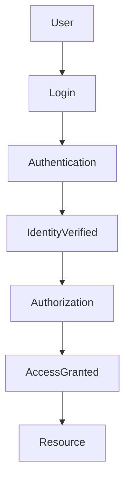

# Authentication and Authorization Documentation

Author: Alexandra Pindrochova

## Overview

This documentation explains two fundamental security concepts used in modern systems:

- Authentication
- Authorization

Authentication verifies the identity of a user, while authorization determines what that user is allowed to access.

Together, these mechanisms protect digital systems and ensure secure access to resources.

---

## Authentication and Authorization Flow

For a dedicated diagram page, see [Authentication Flow Diagram](diagrams/authentication-flow.md).

---

## Documentation Website

The full documentation is available as a rendered website:

➡️ **https://lexieontherun.github.io/authentication-authorization-docs/**

---

## Explore the Documentation

The documentation is organized into several core modules.

### Core Concepts

- [Introduction](docs/introduction.md)
- [Authentication Overview](docs/authentication/authentication-overview.md)
- [Authorization Overview](docs/authorization/authorization-overview.md)
- [Authentication vs Authorization](docs/comparison/authentication-vs-authorization.md)

### Authentication

- [Authentication Methods](docs/authentication/authentication-methods.md)
- [Authentication Policies](docs/authentication/authentication-policies.md)
- [Authentication Events](docs/authentication/authentication-events.md)

### Authorization

- [Role-Based Access Control (RBAC)](docs/authorization/rbac.md)
- [Attribute-Based Access Control (ABAC)](docs/authorization/abac.md)
- [Policy-Based Access Control (PBAC)](docs/authorization/pbac.md)
- [OAuth 2.0 Authorization](docs/authorization/oauth.md)

### Reference

- [Authentication Flow Diagram](diagrams/authentication-flow.md)
- [API Authentication Example](examples/api-authentication-example.md)

---

## Documentation Structure

| Section | Description |
|------|------|
| Authentication | Identity verification methods |
| Authorization | Access control models |
| Comparison | Differences between authentication and authorization |
| Diagrams | System authentication workflows |
| Examples | API authentication documentation |

---

## Documentation Approach

This project demonstrates documentation best practices:

- modular documentation structure
- developer-friendly navigation
- Markdown-based docs-as-code workflow
- diagram-supported explanations
- developer-oriented documentation organization