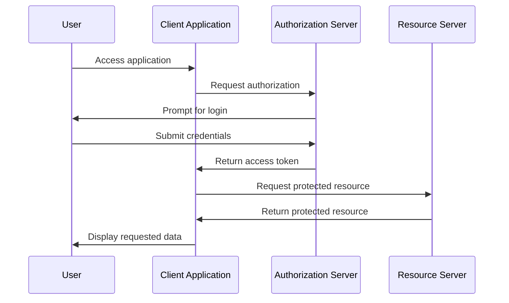

# OAuth 2.0 Authorization

OAuth 2.0 is a widely used authorization framework that allows applications to access resources on behalf of a user.

OAuth issues **access tokens** after successful authentication.

Applications use these tokens to request protected resources.

## Typical OAuth Flow

1. User accesses a client application.
2. The client application redirects the user to an authorization server.
3. The user authenticates with the authorization server.
4. The authorization server issues an access token.
5. The client application uses the token to request protected resources.

## OAuth 2.0 Sequence Diagram

## Why This Matters

OAuth 2.0 separates authentication from resource access and allows applications to securely act on behalf of a user without exposing user credentials directly to the client application.