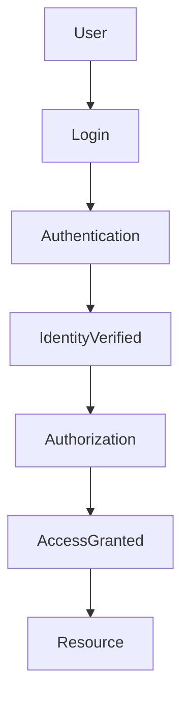

# Authentication and Authorization Guide

Author: Alexandra Pindrochova

Welcome to the **Authentication and Authorization Guide**, a structured technical documentation project that explains how modern systems manage secure access.

Authentication and authorization are fundamental security mechanisms used in web applications, APIs, and cloud platforms.

- **Authentication** verifies a user's identity.
- **Authorization** determines what resources an authenticated user is allowed to access.

---

# Authentication and Authorization Flow

The following diagram illustrates a simplified access control workflow.

For a dedicated diagram page, see:

- [Authentication Flow Diagram](diagrams/authentication-flow)

---

# Documentation Structure

This documentation is organized into the following modules:

| Section | Description |
|------|------|
| Introduction | Overview of authentication and authorization concepts |
| Authentication | Identity verification workflows, policies, events, and methods |
| Authorization | Access control models and permission management |
| Comparison | Differences between authentication and authorization |
| Diagrams | Visual workflows supporting the documentation |
| Examples | Practical API authentication example |

---

# Concepts

Start here for the core concepts behind secure access management.

- [Introduction](docs/introduction)
- [Authentication Overview](docs/authentication/authentication-overview)
- [Authorization Overview](docs/authorization/authorization-overview)
- [Authentication vs Authorization](docs/comparison/authentication-vs-authorization)

---

# Guides

Use these pages to explore how authentication and authorization work in practice.

## Authentication Guides

- [Authentication Policies](docs/authentication/authentication-policies)
- [Authentication Events](docs/authentication/authentication-events)
- [Authentication Methods](docs/authentication/authentication-methods)

## Authorization Guides

- [Role-Based Access Control (RBAC)](docs/authorization/rbac)
- [Attribute-Based Access Control (ABAC)](docs/authorization/abac)
- [Policy-Based Access Control (PBAC)](docs/authorization/pbac)
- [OAuth 2.0 Authorization](docs/authorization/oauth)

---

# Reference

Use these pages for quick supporting material and practical examples.

- [Authentication Flow Diagram](diagrams/authentication-flow)
- [API Authentication Example](examples/api-authentication-example)

---

# Recommended Reading Path

Readers new to the topic can follow this sequence:

1. [Introduction](docs/introduction)
2. [Authentication Overview](docs/authentication/authentication-overview)
3. [Authorization Overview](docs/authorization/authorization-overview)
4. [Authentication vs Authorization](docs/comparison/authentication-vs-authorization)
5. [Authentication Methods](docs/authentication/authentication-methods)
6. [OAuth 2.0 Authorization](docs/authorization/oauth)
7. [API Authentication Example](examples/api-authentication-example)

---

# About This Project

This documentation demonstrates common practices used in modern technical writing.

The project is structured using a **docs-as-code approach**, where documentation is written, versioned, and published using developer tools and workflows.

The documentation illustrates how authentication and authorization systems can be explained clearly through:

- structured developer documentation
- modular content organization
- diagram-supported explanations
- Markdown-based documentation
- a published documentation site using GitHub Pages

This project is intended as a **technical writing portfolio example demonstrating how complex security concepts can be documented for technical audiences.**